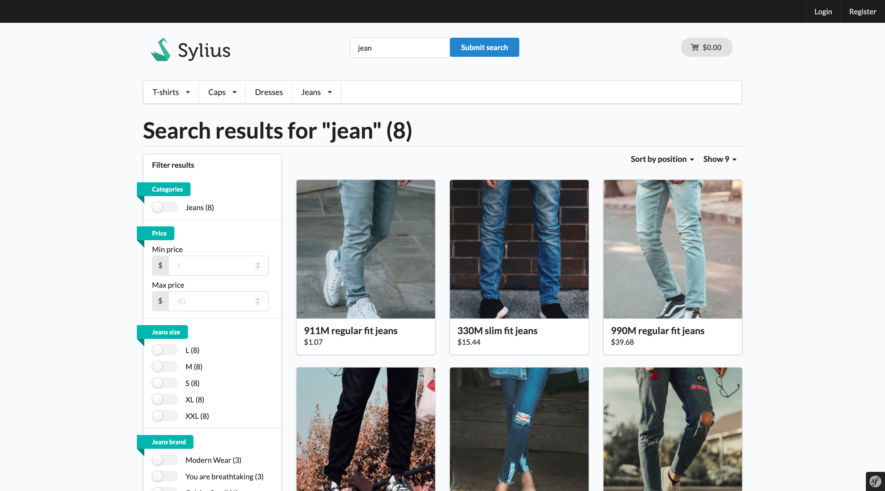
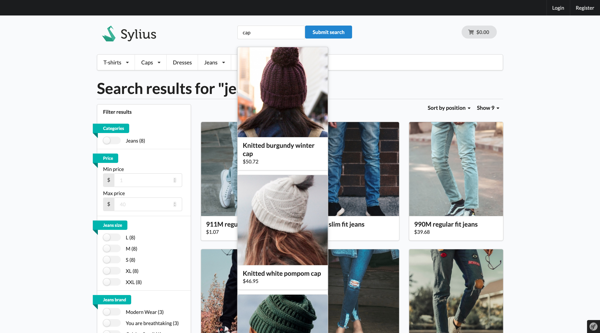

<p align="center">
    <a href="https://monsieurbiz.com" target="_blank">
        
    </a>
    &nbsp;&nbsp;&nbsp;&nbsp;
    <a href="https://sylius.com" target="_blank">
        
    </a>
</p>

<h1 align="center">Search</h1>

[](https://github.com/monsieurbiz/SyliusSearchPlugin/blob/master/LICENSE.txt)
[](https://github.com/monsieurbiz/SyliusSearchPlugin/actions?query=workflow%3A%22PHP+Composer%22)
[](https://scrutinizer-ci.com/g/monsieurbiz/SyliusSearchPlugin/?branch=master)

A search plugin for Sylius using [Jane](https://github.com/janephp/janephp) and [Elastically](https://github.com/jolicode/elastically).





## Installation

Require the plugin :  
`composer require monsieurbiz/sylius-search-plugin`

> If you are using Symfony Flex, the recipe will automatically do the actions below.

Then create the config file in `config/packages/monsieurbiz_search_plugin.yaml` : 

```yaml
imports:
  - { resource: "@MonsieurBizSyliusSearchPlugin/Resources/config/config.yaml" }

monsieurbiz_sylius_search:
  search_file: '%kernel.project_dir%/src/MonsieurBizSearchPlugin/Resources/config/elasticsearch/search.json'
  instant_file: '%kernel.project_dir%/src/MonsieurBizSearchPlugin/Resources/config/elasticsearch/instant.json'
  documentable_classes :
    - 'App\Entity\Product'
```

Import routes in `config/routes.yaml` :
```yaml
monsieurbiz_search_plugin:
  resource: "@MonsieurBizSyliusSearchPlugin/Resources/config/routing.yaml"
```

Modify `config/bundles.php` to add this line at the end : 
```
    MonsieurBiz\SyliusSearchPlugin\MonsieurBizSyliusSearchPlugin::class => ['all' => true],
```

Finally configure plugin in your `.env` file, ina dding this att the end : 
```
###> MonsieurBizSearchPlugin ###
MONSIEURBIZ_SEARCHPLUGIN_ES_HOST=localhost
MONSIEURBIZ_SEARCHPLUGIN_ES_PORT=9200
###< MonsieurBizSearchPlugin ###
```

## Infrastructure

The plugin was developed for Elasticsearch 7.2.x versions. 
You need to have `analysis-icu` and `analysis-phonetic` elasticsearch plugin installed.

### Development 

Elasticsearch is available on `9200` port : http://127.0.0.1:9200/  
Cerebro on port `9000` : http://127.0.0.1:9000/#/overview?host=http:%2F%2Felasticsearch:9200  
Kibana on port `5601` : http://127.0.0.1:5601/ 

On your machine, Elasticsearch is available at http://127.0.0.1:9200/  
In docker, Elasticsearch is available at http://elasticsearch:9200/  
This is the second URL you have to put on Cerebro, Kibana and Elasticsearch if you want to connect to the cluster.  

For a development infrastructure with docker, you can check the [Monsieur Biz Sylius infra](https://github.com/monsieurbiz/sylius-infra/)

## Setup

Make your `Product` entity implements [DocumentableInterface](#Documentable objects).
Run the populate [command](#Command).

## Configuration

The default module configuration is : 

```yaml
monsieur_biz_sylius_search:
    search_file: '%kernel.project_dir%/src/MonsieurBizSearchPlugin/Resources/config/elasticsearch/search.json'
    instant_file: '%kernel.project_dir%/src/MonsieurBizSearchPlugin/Resources/config/elasticsearch/instant.json'
    documentable_classes :
        - 'App\Entity\Product'
```

You can customize it in `config/packages/monsieurbiz_sylius_search_plugin.yaml`.

`search_file` is the JSON used to perform the search.
`instant_file` is the JSON used to perform the search.

The `{{QUERY}}` string inside is replaced in PHP by the query typed by the user.

`documentable_classes` is an array of entities which can be indexed in Elasticsearch.

## Documentable objects

If you want to index an object in the search index, your entity have to implements `MonsieurBiz\SyliusSearchPlugin\Model\DocumentableInterface` interface : 

```php
interface DocumentableInterface
{
    public function getDocumentType(): string;
    public function convertToDocument(string $locale): DocumentResult;
}
```

Here is an exemple for the product conversion : 

```php
<?php

declare(strict_types=1);

namespace App\Entity\Product;

use Doctrine\ORM\Mapping as ORM;
use MonsieurBiz\SyliusSearchPlugin\Model\DocumentableInterface;
use MonsieurBiz\SyliusSearchPlugin\Model\DocumentResult;
use Sylius\Component\Core\Model\Product as BaseProduct;
use Sylius\Component\Core\Model\ProductTranslation;
use Sylius\Component\Product\Model\ProductTranslationInterface;

/**
 * @ORM\MappedSuperclass
 * @ORM\Table(name="sylius_product")
 */
class Product extends BaseProduct implements DocumentableInterface
{
    protected function createTranslation(): ProductTranslationInterface
    {
        return new ProductTranslation();
    }
    public function getDocumentType(): string
    {
        return 'product';
    }

    public function convertToDocument(string $locale): DocumentResult
    {
        $document = new DocumentResult();

        // Document data
        $document->setType($this->getDocumentType());
        $document->setCode($this->getCode());
        $document->setId($this->getId());
        $document->setEnabled($this->isEnabled());
        $document->setSlug($this->getTranslation($locale)->getSlug());

        /** @var \Sylius\Component\Core\Model\Image $image */
        if ($image = $this->getImages()->first()) {
            $document->setImage($image->getPath());
        }

        /** @var \Sylius\Component\Core\Model\Channel $channel */
        foreach ($this->getChannels() as $channel) {
            $document->addChannel($channel->getCode());

            // TODO Get cheapest variant
            /** @var \Sylius\Component\Core\Model\ProductVariant $variant */
            if ($variant = $this->getVariants()->first()) {
                $price = $variant->getChannelPricingForChannel($channel);
                // TODO Index all currencies
                $document->addPrice($channel->getCode(), $channel->getBaseCurrency()->getCode(), $price->getPrice());
                if ($originalPrice = $price->getOriginalPrice()) {
                    $document->addOriginalPrice($channel->getCode(), $channel->getBaseCurrency()->getCode(), $originalPrice);
                }
            }
        }

        $document->addAttribute('name', 'Name', [$this->getTranslation($locale)->getName()], $locale, 50);
        $document->addAttribute('description', 'Description', [$this->getTranslation($locale)->getDescription()], $locale, 10);
        $document->addAttribute('short_description', 'Short description', [$this->getTranslation($locale)->getShortDescription()], $locale, 10);

        // TODO : Add fallback locale
        /** @var \Sylius\Component\Attribute\Model\AttributeValueInterface $attribute */
        foreach ($this->getAttributesByLocale($locale, $locale) as $attribute) {
            $attributeValues = [];
            if (isset($attribute->getAttribute()->getConfiguration()['choices'])) {
                foreach ($attribute->getValue() as $value) {
                    $attributeValues[] = $attribute->getAttribute()->getConfiguration()['choices'][$value][$locale];
                }
            } else {
                $attributeValues[] = $attribute->getValue();
            }
            $document->addAttribute($attribute->getCode(), $attribute->getName(), $attributeValues, $attribute->getLocaleCode(), 1);
        }
        return $document;
    }
}
```

You can add everything you want !

## Score by attribute

Each document attribute can have a `score`. It means it can be more important than another.
For example, the product name in the exemple above has a score of `50`, and the description a score of `10` : 
```php
$document->addAttribute('name', 'Name', [$this->getTranslation($locale)->getName()], $locale, 50);
$document->addAttribute('description', 'Description', [$this->getTranslation($locale)->getDescription()], $locale, 10);
```

## Improve search accuracy

You can customize the search with your custom JSON files and modifying : 

```yaml
monsieur_biz_sylius_search:
    search_file: '%kernel.project_dir%/src/MonsieurBizSearchPlugin/Resources/config/elasticsearch/search.json'
    instant_file: '%kernel.project_dir%/src/MonsieurBizSearchPlugin/Resources/config/elasticsearch/instant.json'
```

## Indexed Documents

Indexed documents are all entities defined in `monsieur_biz_search.documentable_classes` dans implements `DocumentableInterface`.

```yaml
monsieur_biz_sylius_search:
    documentable_classes :
        - 'App\Entity\Product'
```

## Command

A symfony command is available to populate index : `console monsieurbiz:search:populate`

## Index on save

For product entity, we have a listener to add / update / delete document on save.
It is the `App\MonsieurBizSearchPlugin\EventListener\DocumentListener` class which : 
- `saveDocument` on `post_create` dans `post_update`
- `removeDocument` on `pre_delete`

If your entity implements `DocumentableInterface`, you can add listeners to manage entities modifications (Replace `<YOUR_ENTITY>` with your) :
```yaml
    app.event_listener.document_listener:
        class: App\MonsieurBizSearchPlugin\EventListener\DocumentListener
        arguments:
            - '@App\MonsieurBizSearchPlugin\Indexer\DocumentIndexer'
        tags:
            - { name: kernel.event_listener, event: sylius.<YOUR_ENTITY>.post_create, method: saveDocument }
            - { name: kernel.event_listener, event: sylius.<YOUR_ENTITY>.post_update, method: saveDocument }
            - { name: kernel.event_listener, event: sylius.<YOUR_ENTITY>.pre_delete, method: deleteDocument }
```

## Url Params

If you add a new entity in search index. You have to be able to generate an URL when you display it.
In order to do that, you can customize the `RenderDocumentUrl` twig extension : 
```php
public function getUrlParams(DocumentResult $document): UrlParamsProvider {
    switch ($document->getType()) {
        case "product" :
            return new UrlParamsProvider('sylius_shop_product_show', ['slug' => $document->getSlug(), '_locale' => $document->getLocale()]);
            break;
            
        // Add new case !
    }
    
    throw new NotSupportedTypeException(sprintf('Object type "%s" not supported to get URL', $this->getType()));
}
```

## Display search form in front

A Twig method is available to display the form : `search_form()`. You can pass a parameter to specify a custom template.  
By default, the form is display on `sonata.block.event.sylius.shop.layout.header` event.

## Front customization

You can override all templates in your theme to : 
- Customize search results display page (`src/MonsieurBizSearchPlugin/Resources/views/Search/`)
- Customize instant search display block (`src/MonsieurBizSearchPlugin/Resources/views/Instant/`)
- Customize JS parameters (`src/MonsieurBizSearchPlugin/Resources/views/Instant/instant_javascript.html.twig`)

## Jane

We are using [Jane](https://github.com/janephp/janephp) to create a DTO (Data-transfer object).
Generated classes are on `src/MonsieurBizSearchPlugin/generated` folder.
Jane configuration and JSON Schema are on `src/MonsieurBizSearchPlugin/Resources/config/jane` folder.

## Elastically

The [Elastically](https://github.com/jolicode/elastically) Client is configured in `src/MonsieurBizSearchPlugin/Resources/config/services.yaml` file.
You can customize it if you want in `config/services.yaml`.
Analyzers and YAML mappings are on `src/MonsieurBizSearchPlugin/Resources/config/elasticsearch` folder.

You can also find JSON used bu plugin to perform the search on Elasticsearch : 
- `src/MonsieurBizSearchPlugin/Resources/config/elasticsearch/instant.json`
- `src/MonsieurBizSearchPlugin/Resources/config/elasticsearch/search.json`

These JSON can be customized in another folder if you change the plugin config.
